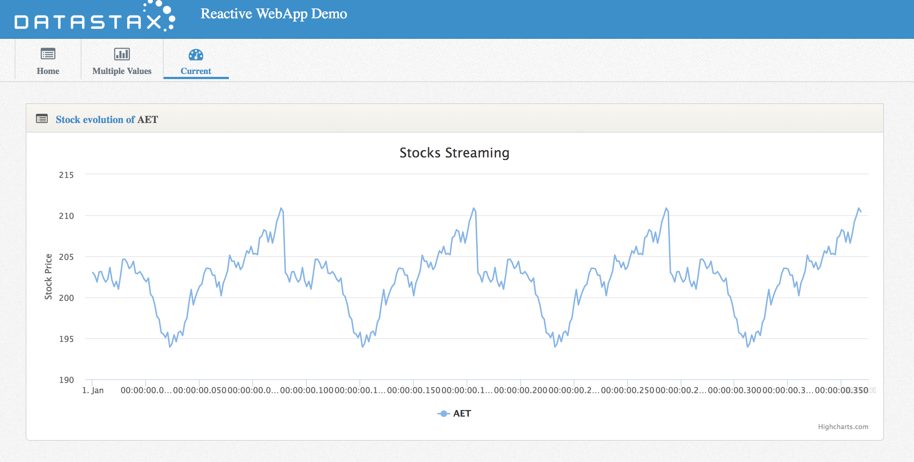
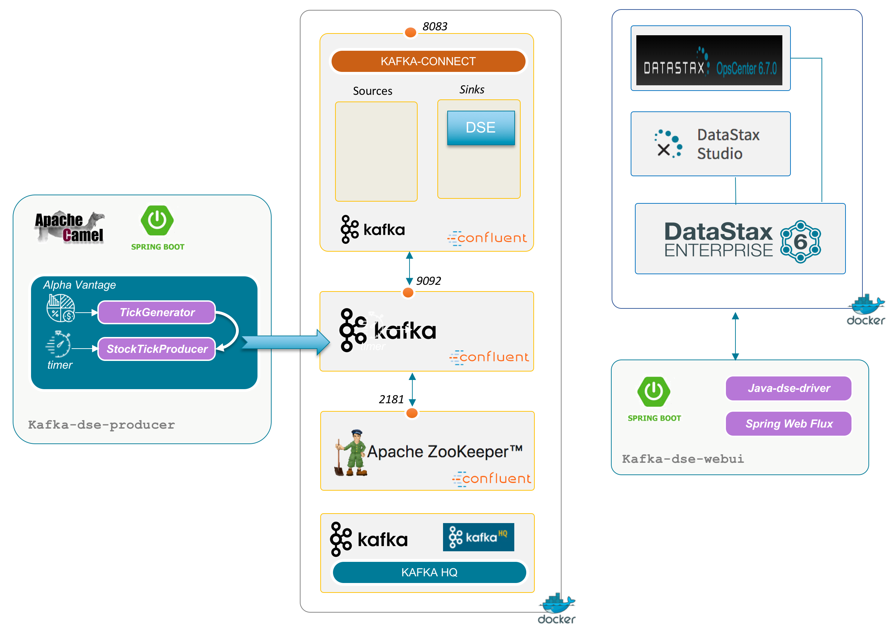

# DataStax Apache Kafka™ Connector and Reactive Driver

This project is a demo illustrating *DataStax Apache Kafka™ Connector* and the new reactive driver. Stocks valuations events are generated, pushed to Kafka and sent to DataStax Enterprise.




## Overview 

### Architecture



### Maven modules :

- [kafka-dse-core](kafka-dse-core) contains domain beans and utility classes
- [kafka-dse-producer](kafka-dse-producer) is a standalone Spring Boot application that generates random Tick Data load from AlphaVantage and send Json events to kafka topics `stocks_ticks` 
- [kafka-dse-consumer](kafka-dse-consumer) is a standalone Spring Boot application that read from 
- [kafka-dse-webui](kafka-dse-webui) is the standalone web UI.


## Install and run

1. Clone this repository on your laptop, driver2 branch

```bash
git clone -b driver2 https://github.com/clun/kafka-dse.git
```

2. Compile source code and modules 

```
cd kafka-dse

mvn clean install
```
 
3. Start `Kafka` and `DataStax` components using the following command :
 
```bash
docker-compose up -d
```

 You have now access to :
  - [KafkaHQ](http://localhost:8080/docker-kafka-server/topic), a web ui to look into Kafka topics.
  - [DataStax Studio](http://localhost:9091) : edit the connection to point to `dse` host name of datastax Enterprise

4. Start the `kafka-dse-producer` component. Open the folder `kafka-dse-producer` and execute the following

```
cd kafka-dse-producer

mvn spring-boot:run 
```

This will create the keySpace `demo_kafka` if needed, and the expected tables `stocks_infos` and `stocks_ticks`. `stocks_infos` is loaded with a list of Stocks codes to be retrieved.

To see incoming event in the topic you can use the [KafkaHQ UI](http://localhost:8080/docker-kafka-server/topic) and use the embedded tool provided by Kafka:

```
docker exec -i -t kafka-dse_kafka_1 kafka-console-consumer --bootstrap-server localhost:9092 --from-beginning --topic stocks_ticks
```

You should see something like

```
{"symbol":"TGT","valueDate":"2019-03-06T09:42:51.242Z","value":72.29042675857293}
{"symbol":"MPC","valueDate":"2019-03-06T09:42:51.243Z","value":59.04528781377921}
{"symbol":"CVS","valueDate":"2019-03-06T09:42:51.243Z","value":53.99304938100401}
{"symbol":"ABC","valueDate":"2019-03-06T09:42:51.243Z","value":81.10990156983966}
{"symbol":"C","valueDate":"2019-03-06T09:42:51.243Z","value":62.885685814641356}
{"symbol":"VZ","valueDate":"2019-03-06T09:42:51.243Z","value":58.235384086812275}
{"symbol":"CVX","valueDate":"2019-03-06T09:42:51.243Z","value":122.11841963153303}
{"symbol":"JPM","valueDate":"2019-03-06T09:42:51.243Z","value":107.49725481587726}
{"symbol":"F","valueDate":"2019-03-06T09:42:51.243Z","value":8.861661896519792}
{"symbol":"BRK.A","valueDate":"2019-03-06T09:42:51.243Z","value":301526.64877576346}
{"symbol":"JNJ","valueDate":"2019-03-06T09:42:51.243Z","value":142.508769918913}
{"symbol":"ADM","valueDate":"2019-03-06T09:42:51.243Z","value":42.757409759352036}
{"symbol":"UNH","valueDate":"2019-03-06T09:42:51.243Z","value":243.075302209574}
{"symbol":"PFE","valueDate":"2019-03-06T09:42:51.243Z","value":42.58821518419893}
{"symbol":"PRU","valueDate":"2019-03-06T09:42:51.243Z","value":101.21939105941746}
{"symbol":"T","valueDate":"2019-03-06T09:42:51.243Z","value":33.00476819346831}
{"symbol":"WFC","valueDate":"2019-03-06T09:42:51.243Z","value":49.8785431886429}
{"symbol":"IBM","valueDate":"2019-03-06T09:42:51.243Z","value":135.1453199656281}
{"symbol":"VLO","valueDate":"2019-03-06T09:42:51.244Z","value":80.76656130882697}
```

5. Start the `kafka-dse-webui` component. 

Open the folder kafka-dse-webui :

```
cd ../kafka-dse-webui

mvn spring-boot:run 
```

You will have access to :
- [The web UI](http://localhost:8082) user interface to see charts


You can start `kafka-dse-consumer` component using again `spring-boot:run` and see events coming in Datastax Enterprise and the UI but this one is only for test. But you want to use the sink.

6. Download the *DataStax Apache Kafka™ Connector* from [academy.datastax.com] and put the library in `kafka-dse-sink` folder here. Then execute the following :

```
docker-compose -f docker-compose-connect.yml up
```

Kafka-Connect is starting. You can in the log that the class `com.datastax.kafkaconnector.DseSinkConnector` is detected in the classpath. When the service is up (http interface is OK) we register the sink using a POST query.

You can look to `kafka-connect` [sinks here](http://localhost:18083/connectors/) ou our [config here](http://localhost:18083/connectors/dse_stock_ticks)

More informations on the [DataStax Documentation](https://docs.datastax.com/en/kafka/doc/index.html)


